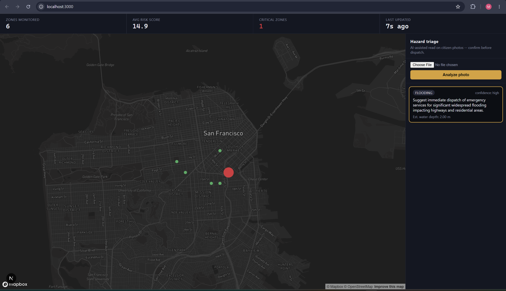
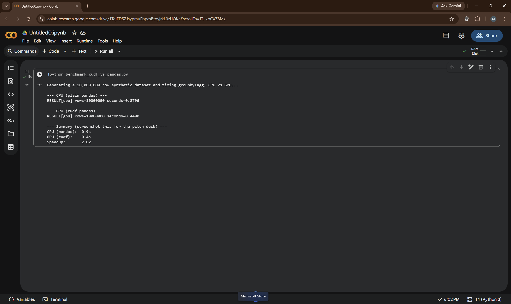

<div align="center">


# OmniCommand AI 🚨

### Real-time Urban Infrastructure Risk Intelligence

**City sensor streams → Live risk scores → AI-powered hazard triage → Field dispatch decisions**

[](https://omni-command.vercel.app/)
[](https://omnicommand-production.up.railway.app/health)
[](https://omnicommand-production.up.railway.app/docs)


</div>

---

## 🎯 The Problem

City infrastructure failures — burst water mains, pressure drops, leak cascades — are detected *after* the damage is done. Emergency response teams rely on slow batch reports and manual sensor checks. By the time the right crew is dispatched, thousands of liters have been lost and roads are flooded.

**OmniCommand AI solves this:** water pressure and flow sensors across 10 city zones stream continuously into the system. A physics-based risk formula spots anomalies in real-time (pressure drops + flow spikes = burst pipe signature). Citizen-submitted hazard photos are triaged by Gemini AI within seconds. The result: a live command dashboard that tells dispatchers *exactly* which zone needs attention right now — and how urgent.

---

## 🔗 Live Links

| Service | URL | Status |
|---|---|---|
| **🌐 Live Dashboard** | [omni-command.vercel.app](https://omni-command.vercel.app/) | [](https://omni-command.vercel.app/) |
| **⚡ Backend API** | [omnicommand-production.up.railway.app](https://omnicommand-production.up.railway.app/health) | [](https://omnicommand-production.up.railway.app/health) |
| **📖 Swagger Docs** | [/docs](https://omnicommand-production.up.railway.app/docs) | Auto-generated |

---

## 🏗️ Architecture

```
┌─────────────────────────────────────────────────────────────────────────────┐
│                          OmniCommand AI — Data Flow                         │
└─────────────────────────────────────────────────────────────────────────────┘

  INGEST LAYER                 STREAM PROCESSING              INTELLIGENCE LAYER
  ────────────                 ─────────────────              ──────────────────
  
  ┌──────────────┐             ┌─────────────────┐            ┌────────────────┐
  │  Sensor CSV  │  producer   │  Apache Kafka   │  consumer  │ risk_scoring   │
  │  (1000 rows) │ ──────────► │  Confluent      │ ─────────► │ .py            │
  │  10 zones    │  0.5s/row   │  Cloud          │  3s batch  │                │
  │  S001–S010   │             │  urban-sensor-  │            │ cuDF/pandas    │
  └──────────────┘             │  events topic   │            │ GPU-accelerated│
                               └─────────────────┘            │                │
                                                               │ pressure_drop  │
  MULTIMODAL AI                                                │  × 40 pts      │
  ─────────────                                                │ flow_spike     │
                                                               │  × 3 pts       │
  ┌──────────────┐  photo      ┌─────────────────┐            └───────┬────────┘
  │ Citizen Photo│ ──────────► │  Gemini 2.5     │                    │
  │ Upload       │  multipart  │  Flash (ADK)    │                    │ RiskScore[]
  └──────────────┘             │                 │                    ▼
                               │  hazard_type    │            ┌────────────────┐
                               │  water_depth_m  │            │  Upstash Redis │
                               │  confidence     │            │  live cache    │
                               │  recommendation │            │  risk:{zone}   │
                               └────────┬────────┘            └───────┬────────┘
                                        │                             │
  PERSISTENCE                           │                             │
  ───────────                           │                             ▼
                                        │                    ┌────────────────┐
                               ┌────────▼──────────────────► │  BigQuery      │
                               │       FastAPI               │  GCP           │
                               │  omnicommand-production     │  historical log│
                               │       .railway.app          └────────────────┘
                               │                │
  FRONTEND                               REST + WebSocket
  ────────                               │
  ┌──────────────────────────────────────▼──────────────────┐
  │                   Next.js 15 (Vercel)                   │
  │                 omni-command.vercel.app                 │
  │                                                         │
  │  ┌────────────────┐  ┌──────────────┐  ┌────────────┐  │
  │  │  Mapbox GL JS  │  │   System     │  │   Action   │  │
  │  │  + Deck.gl     │  │   Tickers    │  │   Panel    │  │
  │  │  ScatterPlot   │  │   (live KPIs)│  │ (AI triage)│  │
  │  │  risk colors   │  │              │  │            │  │
  │  └────────────────┘  └──────────────┘  └────────────┘  │
  └─────────────────────────────────────────────────────────┘
```

### Component Diagram

```
┌──────────────────┐    ┌──────────────────────────────────────────────────────┐
│   data-producer/ │    │              analytics-engine/                        │
│                  │    │                                                        │
│  producer.py     │    │  ┌─────────────┐   ┌──────────────┐  ┌────────────┐  │
│  ─────────────   │    │  │ streaming/  │   │ processing/  │  │   api/     │  │
│  Reads CSV       │    │  │ consumer.py │──►│risk_scoring  │  │websocket   │  │
│  1 row per 500ms │    │  │             │   │.py           │  │.py         │  │
│  → Kafka topic   │───►│  │ micro-batch │   │              │  │            │  │
│                  │    │  │ every 3s    │   │ cuDF/pandas  │  │routes_risk │  │
└──────────────────┘    │  └─────────────┘   └──────┬───────┘  │.py         │  │
                        │                           │          │            │  │
                        │  ┌─────────────────────────▼──────┐  │routes_triage  │
                        │  │        integrations/            │  │.py         │  │
                        │  │  redis_client.py  (live state)  │  └────────────┘  │
                        │  │  bigquery_client.py (history)   │                  │
                        │  │  gemini_client.py  (AI triage)  │                  │
                        │  └─────────────────────────────────┘                  │
                        └──────────────────────────────────────────────────────┘

┌──────────────────────────────────────────────────────────────────────────────┐
│                            triage-agent/                                      │
│  Google ADK Agent Platform — flood_triage_agent/agent.py                     │
│  Analyzes hazard photos via Gemini 2.5 Flash, returns structured JSON        │
└──────────────────────────────────────────────────────────────────────────────┘

┌──────────────────────────────────────────────────────────────────────────────┐
│                              frontend/src/                                    │
│  app/page.tsx          ← state orchestration (riskScores, alerts)            │
│  components/MapView.tsx ← Deck.gl ScatterplotLayer on Mapbox dark style      │
│  components/SystemTickers.tsx ← live KPI bar (zones, avg risk, criticals)    │
│  components/ActionPanel.tsx   ← photo upload + Gemini triage feed            │
│  lib/api.ts            ← REST + WebSocket client helpers                     │
└──────────────────────────────────────────────────────────────────────────────┘
```

---

## 🧠 Risk Scoring Algorithm

The core intelligence is a **physics-based formula** derived from the actual sensor dataset, not a black-box model — this makes it interpretable and auditable:

```
Burst pipes (n=10)  → avg pressure: 1.35 bar | avg flow: 166 L/s
Normal pipes (n=990)→ avg pressure: 3.24 bar | avg flow: 125 L/s

PRESSURE_DROP_THRESHOLD = 2.25 bar   ← midpoint between burst and normal
FLOW_SPIKE_THRESHOLD    = 160 L/s   ← above burst average

risk_score = (
    max(0, PRESSURE_DROP_THRESHOLD - avg_pressure) × 40   ← pressure loss signal
  + max(0, avg_flow - FLOW_SPIKE_THRESHOLD)         × 3    ← flow surge signal
)
risk_score = clamp(risk_score, 0, 100)
```

| Score | Level | Color |
|---|---|---|
| 0–25 | 🟢 Low | Green |
| 25–60 | 🟡 Medium | Amber |
| 60–85 | 🟠 High | Orange |
| 85–100 | 🔴 Critical | Red |

> **Key design choice:** `burst_status` labels are never used in the scoring formula — this ensures validation against those labels is a genuine predictive test, not circular.

---

## 🤖 AI Triage — Gemini + Google ADK

Field workers or citizens photograph a hazard (flooding, burst main, road blockage). The image is:

1. Uploaded to the frontend via `ActionPanel`
2. `POST /api/triage` → `analytics-engine` → ADK agent server
3. `flood_triage_agent` (Google ADK) sends to **Gemini 2.5 Flash** with a structured prompt
4. Gemini identifies hazard type, estimates water depth using visible reference objects (cars, curbs, people), and returns a recommendation
5. Result is **broadcast over WebSocket** to all connected dashboards instantly

```json
{
  "hazard_type": "flooding",
  "estimated_water_depth_m": 0.4,
  "recommendation": "Recommend dispatching water rescue unit to Zone-C for human confirmation before any evacuation order.",
  "confidence": "high"
}
```

> **Safety note:** Gemini output is framed as decision support for a human dispatcher — never an autonomous trigger for real-world actions. A misjudged water depth from a blurry photo degrades gracefully (confidence: low) rather than causing a false dispatch.

**Live triage in action — flooding detected, water depth estimated at 2.0 m, confidence: high:**



---

## ⚡ GPU Acceleration — NVIDIA cuDF / RAPIDS

`risk_scoring.py` uses **`cudf.pandas`** — a drop-in replacement for pandas that transparently runs on NVIDIA GPU when available:

```python
try:
    import cudf.pandas
    cudf.pandas.install()   # ← one line, same code runs on GPU
except ImportError:
    pass                    # ← silently falls back to CPU pandas
```

- **Same code, both environments** — no branching, no rewrites
- Live demo (1000 rows) runs fine on CPU; speedup is demonstrated on large synthetic datasets
- `benchmark_cudf_vs_pandas.py` generates 5–10M row synthetic data and prints CPU vs GPU timing (run on a free Google Colab T4)

**Benchmark result on Google Colab T4 GPU — 10 million rows:**



> CPU (pandas): **0.9s** → GPU (cudf): **0.4s** → **2.0× speedup** on 10,000,000 rows

---

## 🗂️ Project Structure

```
OmniCommand-AI/
├── docker-compose.yml              # Local: Kafka + Zookeeper + Redis
├── data/
│   └── water_leak_detection_1000_rows.csv   # 10 sensors, 1000 events
│
├── data-producer/
│   ├── producer.py                 # CSV → Kafka, 0.5s per row
│   └── requirements.txt
│
├── analytics-engine/               # FastAPI backend (deployed: Railway)
│   ├── main.py                     # CORS, routers, WebSocket, startup thread
│   ├── config.py                   # Pydantic settings (reads .env)
│   ├── requirements.txt
│   ├── .env.example                # ← copy to .env and fill in keys
│   ├── models/schemas.py           # SensorEvent, RiskScore, TriageResponse
│   ├── streaming/
│   │   └── consumer.py             # Kafka micro-batch consumer (background thread)
│   ├── processing/
│   │   ├── risk_scoring.py         # Physics formula + cuDF/pandas
│   │   └── benchmark_cudf_vs_pandas.py  # GPU vs CPU timing proof
│   ├── integrations/
│   │   ├── redis_client.py         # Live state cache
│   │   ├── bigquery_client.py      # Historical log
│   │   └── gemini_client.py        # Multimodal photo triage
│   └── api/
│       ├── websocket.py            # ConnectionManager + broadcast
│       ├── routes_risk.py          # GET /api/risk-scores, GET /api/history/{zone}
│       └── routes_triage.py        # POST /api/triage
│
├── triage-agent/                   # Google ADK Agent
│   ├── requirements.txt
│   └── flood_triage_agent/
│       ├── agent.py                # root_agent = Agent(model="gemini-2.5-flash")
│       └── .env.example
│
└── frontend/                       # Next.js 15 (deployed: Vercel)
    ├── package.json
    ├── tsconfig.json
    ├── .env.local.example          # ← copy to .env.local and fill in keys
    └── src/
        ├── app/
        │   ├── layout.tsx
        │   ├── page.tsx            # State: riskScores[], alerts[]
        │   └── globals.css
        ├── components/
        │   ├── MapView.tsx         # Deck.gl ScatterplotLayer on Mapbox
        │   ├── SystemTickers.tsx   # Live KPI bar
        │   └── ActionPanel.tsx     # Photo upload + triage results
        └── lib/
            └── api.ts              # fetchRiskScores, submitTriagePhoto, openLiveSocket
```

---

## 🚀 REST & WebSocket API Reference

| Method | Endpoint | Description |
|---|---|---|
| `GET` | `/health` | `{"status": "ok"}` — liveness check |
| `GET` | `/api/risk-scores` | Current `RiskScore[]` for all 10 zones from Redis |
| `GET` | `/api/history/{pipe_section}?hours=24` | Historical rows from BigQuery |
| `POST` | `/api/triage` | Upload photo → Gemini → `TriageResponse` |
| `WS` | `/ws/live` | Push `risk_update` and `triage_alert` events to dashboard |

**WebSocket message shapes:**
```json
{ "type": "risk_update",  "data": [ /* RiskScore[] */ ] }
{ "type": "triage_alert", "data": { /* TriageResponse */ } }
```

Full interactive docs: **[omnicommand-production.up.railway.app/docs](https://omnicommand-production.up.railway.app/docs)**

---

## 🛠️ Tech Stack

| Layer | Technology | Why |
|---|---|---|
| **Streaming ingestion** | Apache Kafka (Confluent Cloud) | Durable, ordered event stream; scales to real city sensor volumes |
| **Live state cache** | Redis (Upstash) | Sub-millisecond reads for the dashboard; zone state survives backend restarts |
| **AI triage** | Gemini 2.5 Flash + Google ADK | Multimodal (image + text), structured JSON output, ADK Agent Platform runtime |
| **GCP storage** | BigQuery | Serverless historical log; free tier covers hackathon demo; SQL-queryable after any run |
| **GPU acceleration** | NVIDIA cuDF / RAPIDS (`cudf.pandas`) | Drop-in pandas accelerator; same code runs on GPU or CPU |
| **Map** | Mapbox GL JS + Deck.gl | Dark base map + ScatterplotLayer with risk-level color coding |
| **Frontend** | Next.js 15 + TypeScript | App Router, WebSocket client, real-time state with `useState` / `useEffect` |
| **Backend** | FastAPI + uvicorn | Async REST + WebSocket in one process; Kafka consumer in background thread |
| **Infrastructure** | Docker Compose (local) | Zookeeper + Kafka + Redis — one command local spin-up |

---

## ☁️ Deployment

| Component | Platform | URL |
|---|---|---|
| Frontend | **Vercel** | [omni-command.vercel.app](https://omni-command.vercel.app/) |
| Analytics Engine | **Railway** | [omnicommand-production.up.railway.app](https://omnicommand-production.up.railway.app/) |
| Kafka | **Confluent Cloud** | Managed cluster |
| Redis | **Upstash** | Serverless Redis |
| BigQuery | **Google Cloud** | `omnicommand.sensor_risk_history` |

---

## 🏃 Local Development

**Prerequisites:** Docker Desktop, Python 3.10+, Node.js 18+

```bash
# 1. Clone the repo
git clone https://github.com/your-username/OmniCommand-AI.git
cd OmniCommand-AI

# 2. Spin up local Kafka + Zookeeper + Redis
docker compose up -d

# 3. Analytics Engine  (terminal 1)
cd analytics-engine
cp .env.example .env          # fill in GEMINI_API_KEY at minimum
pip install -r requirements.txt
uvicorn main:app --reload --port 8000

# 4. Triage Agent  (terminal 2)
cd triage-agent
pip install -r requirements.txt
adk api_server . --port 8001

# 5. Sensor Data Producer  (terminal 3)
cd data-producer
pip install -r requirements.txt
python producer.py

# 6. Frontend  (terminal 4)
cd frontend
cp .env.local.example .env.local    # fill in NEXT_PUBLIC_MAPBOX_TOKEN
npm install && npm run dev
```

Open **http://localhost:3000** — the dashboard will start updating live as the producer streams sensor data.

> **Note on Triage Agent (Step 4):** The analytics engine calls Gemini directly in production. Running the ADK agent locally is optional — it gives you the full Agent Platform experience but is not required for the dashboard to function. See the [ADK Setup](#-google-adk-triage-agent-setup) section below.

### Minimum required keys

| Key | Where to get |
|---|---|
| `GEMINI_API_KEY` | [aistudio.google.com/apikey](https://aistudio.google.com/apikey) — free, instant |
| `NEXT_PUBLIC_MAPBOX_TOKEN` | [account.mapbox.com](https://account.mapbox.com/) — free tier |

BigQuery and Confluent Cloud are optional for local dev — the live dashboard works with just Kafka + Redis.

---

## 🤖 Google ADK Triage Agent Setup

The `triage-agent/` folder contains a **Google Agent Development Kit (ADK)** agent that runs the same hazard triage logic through the official Gemini Enterprise Agent Platform runtime. This is what satisfies the Agent Platform rubric requirement.

> **Production vs Local:** In the deployed backend (Railway), `analytics-engine` calls the Gemini API directly — no ADK server needed. Locally, you can optionally run the ADK server to experience the full Agent Platform flow.

### Prerequisites

- Python 3.10+
- A Gemini API key from [aistudio.google.com/apikey](https://aistudio.google.com/apikey) (free, instant)
- *(Optional, for Vertex AI path)* A GCP project with the **Vertex AI API** enabled and `gcloud` CLI installed

### Step 1 — Install the ADK

```bash
cd triage-agent
pip install -r requirements.txt
```

This installs `google-adk` — Google's Agent Development Kit. Verify the install:

```bash
adk --version
```

### Step 2 — Configure the environment

```bash
cd triage-agent/flood_triage_agent
cp .env.example .env
```

Open `.env` and choose one of the two auth paths:

**Option A — AI Studio API key (fastest, recommended for local dev)**
```env
GOOGLE_GENAI_USE_VERTEXAI=False
GOOGLE_API_KEY=your-gemini-api-key-from-aistudio
```
Get your key at [aistudio.google.com/apikey](https://aistudio.google.com/apikey) — it's free and ready instantly.

**Option B — Vertex AI (counts as GCP Enterprise Agent Platform)**
```env
GOOGLE_GENAI_USE_VERTEXAI=True
GOOGLE_CLOUD_PROJECT=your-gcp-project-id
GOOGLE_CLOUD_LOCATION=us-central1
```
Requirements for Option B:
1. A GCP project with the **Vertex AI API** enabled
2. Run `gcloud auth application-default login` to authenticate
3. Or set `GOOGLE_APPLICATION_CREDENTIALS=/path/to/service-account.json`

### Step 3 — Run the ADK API server

Run this from the `triage-agent/` directory (one level above `flood_triage_agent/`):

```bash
cd triage-agent
adk api_server . --port 8001
```

You should see output like:
```
INFO:     Started server process
INFO:     Waiting for application startup.
INFO:     Application startup complete.
INFO:     Uvicorn running on http://0.0.0.0:8001
```

The ADK server is now running at `http://localhost:8001`.

### Step 4 — Test the agent directly

```bash
# Create a session
curl -X POST http://localhost:8001/apps/flood_triage_agent/users/test/sessions/s1 \
  -H "Content-Type: application/json" \
  -d '{}'

# Send a text prompt (without a real image)
curl -X POST http://localhost:8001/run \
  -H "Content-Type: application/json" \
  -d '{
    "appName": "flood_triage_agent",
    "userId": "test",
    "sessionId": "s1",
    "newMessage": {
      "role": "user",
      "parts": [{"text": "There is knee-deep flooding at a city intersection."}]
    }
  }'
```

Expected response shape:
```json
{
  "hazard_type": "flooding",
  "estimated_water_depth_m": 0.5,
  "recommendation": "Suggest dispatching a water rescue unit for human confirmation before taking further action.",
  "confidence": "medium"
}
```

### Step 5 — Explore the ADK Web UI (bonus)

The ADK also ships an interactive web interface for testing agents:

```bash
adk web
```

Open [http://localhost:8000](http://localhost:8000) in your browser — you can chat with the `flood_triage_agent`, inspect event traces, and see the full Agent Platform runtime in action.

### Architecture note

```
Local development path:
  ActionPanel (frontend)
      → POST /api/triage (analytics-engine)
      → analytics-engine/integrations/gemini_client.py
      → [direct Gemini API call]        ← production path (Railway)
      → OR http://localhost:8001/run     ← local ADK path (optional)
            → flood_triage_agent/agent.py
                → Gemini 2.5 Flash
```

Both paths use the same model (`gemini-2.5-flash`) and the same instruction prompt — the ADK layer adds session management, event tracing, and the Agent Platform runtime on top.

---

## 📊 Data Schema

**Input — SensorEvent (from Kafka):**
```python
class SensorEvent(BaseModel):
    timestamp:     str
    sensor_id:     str          # S001 – S010
    pipe_section:  str          # Zone-A – Zone-J
    pressure:      float        # bar
    flow_rate:     float        # L/s
    temperature:   float        # °C
    leak_status:   int          # 0 | 1
    burst_status:  int          # 0 | 1
    anomaly_score: float        # 0.0 (label-free — not used in scoring)
```

**Output — RiskScore (to Redis + WebSocket):**
```python
class RiskScore(BaseModel):
    pipe_section:  str
    risk_score:    float        # 0–100 normalized
    risk_level:    str          # "low" | "medium" | "high" | "critical"
    avg_pressure:  float        # bar
    burst_count:   int          # events in this batch
    updated_at:    datetime     # UTC
```

**AI Output — TriageResponse (from Gemini):**
```python
class TriageResponse(BaseModel):
    zone:                    Optional[str]
    hazard_type:             str
    estimated_water_depth_m: Optional[float]
    recommendation:          str
    confidence:              str            # "low" | "medium" | "high"
```

---

## 🏆 Hackathon Rubric Checklist

| Requirement | Implementation |
|---|---|
| ✅ Real-world user + problem | Emergency response teams, city dispatchers |
| ✅ Specific decision bottleneck | Which zone needs attention right now? |
| ✅ Ingest → clean → analyze → visualize pipeline | Kafka → consumer.py → risk_scoring.py → Next.js |
| ✅ Useful output (score / alert / recommendation) | Per-zone RiskScore + Gemini TriageResponse |
| ✅ 2+ GCP services | BigQuery + Gemini Enterprise Agent Platform (ADK) |
| ✅ NVIDIA acceleration layer | cuDF / RAPIDS via `cudf.pandas` drop-in |
| ✅ Evidence of acceleration | `benchmark_cudf_vs_pandas.py` (CPU vs GPU timing) |

---

## 🤝 Contributing

This is a hackathon project. If you want to extend it:

1. Fork the repo
2. Create a feature branch (`git checkout -b feature/your-feature`)
3. Make changes and test locally
4. Open a PR with a description of what you changed and why

---

## 📄 License

MIT — see [LICENSE](LICENSE) for details.

---

<div align="center">

Built with ❤️ for a hackathon · Powered by Kafka, Gemini, Redis, BigQuery & Deck.gl

[](https://omni-command.vercel.app/)

</div>
